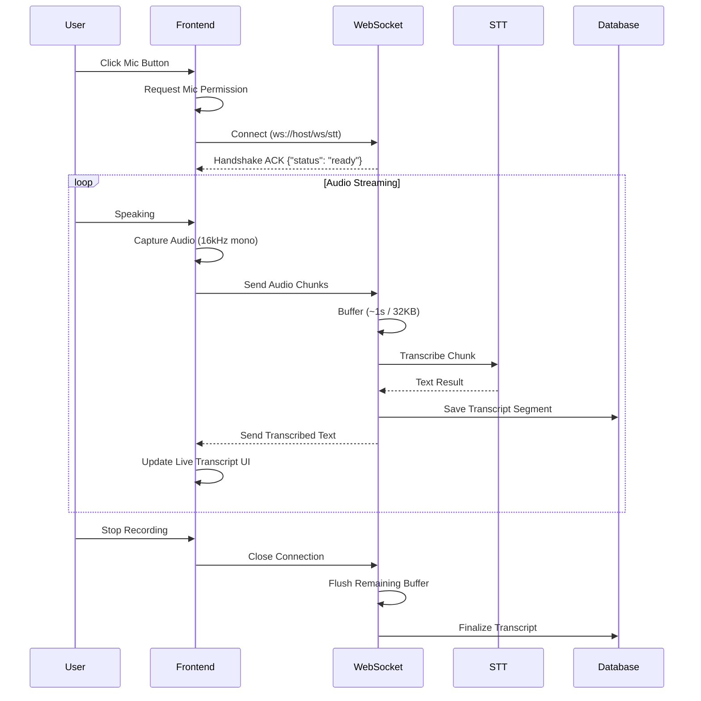
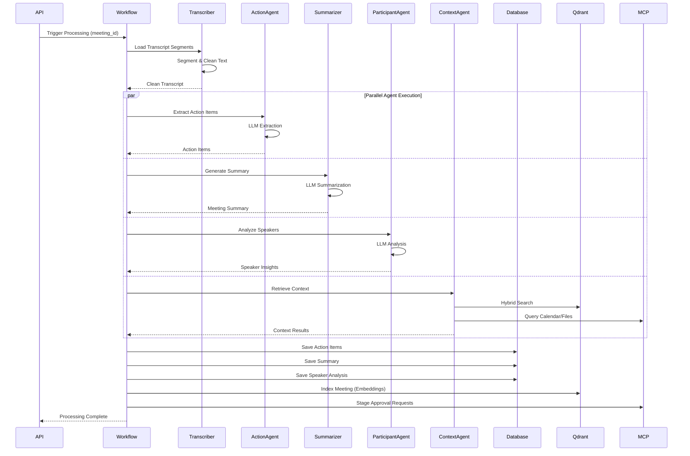
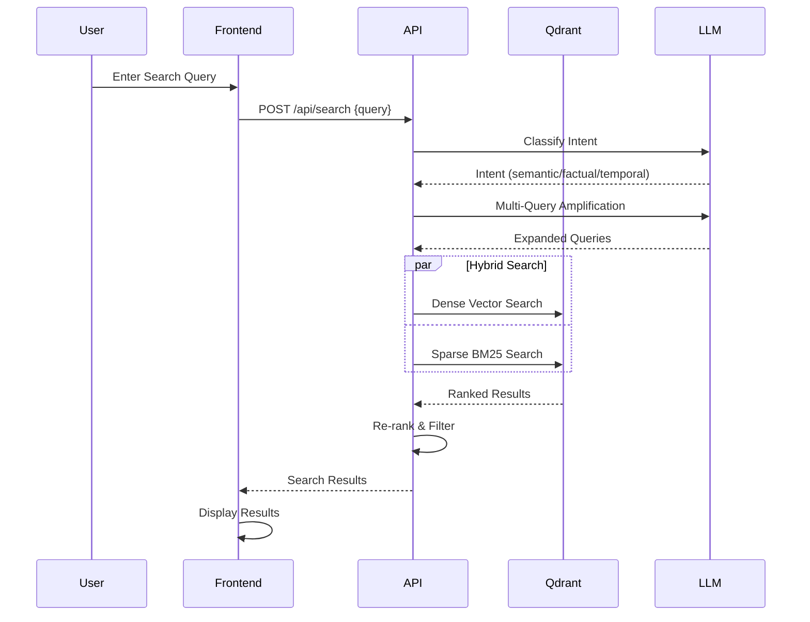
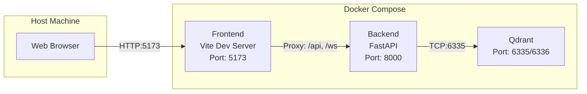
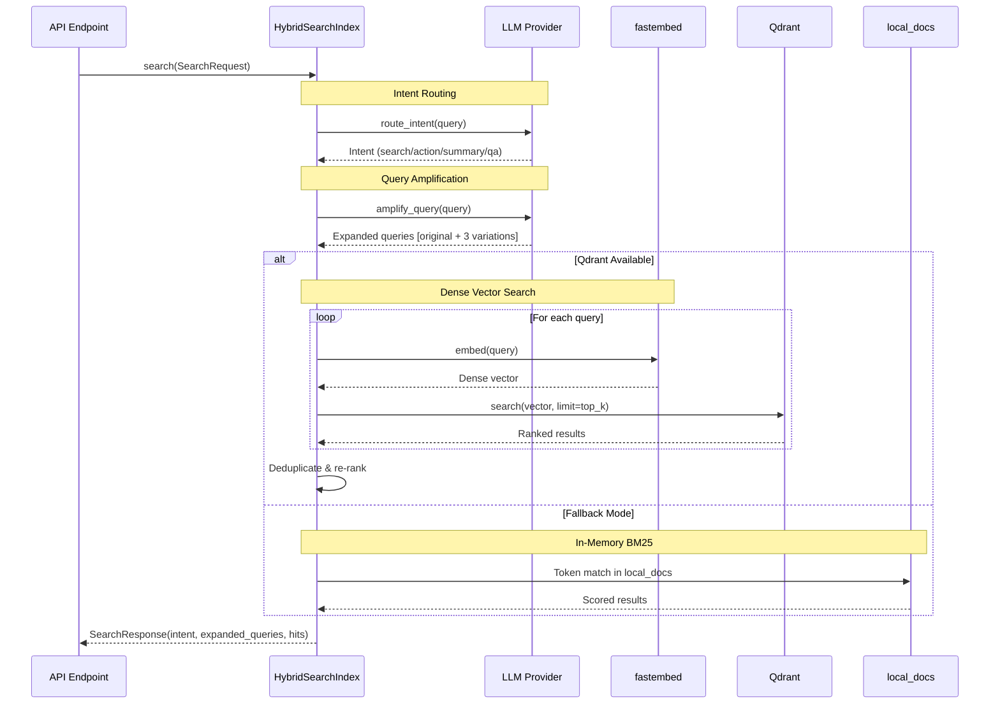

# Personal Meeting Intelligence Agent - Architecture Diagram

## System Architecture

```mermaid
graph TB
    subgraph "Frontend - React Dashboard"
        UI[React Dashboard]
        UI_Mic[Mic Button]
        UI_Live[Live Transcript]
        UI_Search[Search Interface]
        UI_Approvals[Approval Queue]
        UI_Meetings[Meeting List]
    end

    subgraph "Backend - FastAPI"
        API[REST API Endpoints]
        WS[WebSocket STT Endpoint]
        DB[SQLite Database]
        QDRANT[Qdrant Vector Store]
    end

    subgraph "LangGraph Multi-Agent Workflow"
        AGENT_TRANS[Transcriber Agent]
        AGENT_ACTION[Action Item Extractor]
        AGENT_SUMM[Summarizer Agent]
        AGENT_PART[Participant Analyzer]
        AGENT_CTX[Context Retriever]
    end

    subgraph "MCP Tool Integrations"
        MCP_TODO[Todoist]
        MCP_GMAIL[Gmail]
        MCP_CAL[Google Calendar]
        MCP_FS[Filesystem]
    end

    subgraph "External Services"
        STT[Speech-to-Text]
        LLM[LLM Provider]
        EMBED[Embedding Model]
    end

    %% Frontend to Backend Connections
    UI -->|HTTP REST| API
    UI_Mic -->|WebSocket Audio| WS
    UI_Live -->|WebSocket Text| WS
    UI_Search -->|Search Query| API
    UI_Approvals -->|Approve/Reject| API
    UI_Meetings -->|CRUD Operations| API

    %% Backend to Database
    API -->|SQLAlchemy Async| DB
    WS -->|SQLAlchemy Async| DB

    %% Backend to Vector Store
    API -->|Hybrid Search| QDRANT
    API -->|Index/Update| QDRANT

    %% Backend to LangGraph
    API -->|Trigger Workflow| AGENT_TRANS
    WS -->|Finalize Transcript| AGENT_TRANS

    %% LangGraph Agent Flow
    AGENT_TRANS -->|Clean Transcript| AGENT_ACTION
    AGENT_TRANS -->|Clean Transcript| AGENT_SUMM
    AGENT_TRANS -->|Clean Transcript| AGENT_PART
    AGENT_TRANS -->|Clean Transcript| AGENT_CTX

    %% Agents to MCP Tools
    AGENT_ACTION -->|Create Tasks| MCP_TODO
    AGENT_SUMM -->|Send Summary| MCP_GMAIL
    AGENT_CTX -->|Query Calendar| MCP_CAL
    AGENT_CTX -->|Store Reports| MCP_FS

    %% Backend to External Services
    WS -->|Audio Stream| STT
    AGENT_TRANS -->|Transcribe| STT
    AGENT_ACTION -->|Extract Items| LLM
    AGENT_SUMM -->|Generate Summary| LLM
    AGENT_PART -->|Analyze Speakers| LLM
    AGENT_CTX -->|Context Queries| LLM
    API -->|Generate Embeddings| EMBED
    QDRANT -->|Vector Search| EMBED

    %% Styling
    classDef frontend fill:#e1f5ff,stroke:#01579b,stroke-width:2px
    classDef backend fill:#fff3e0,stroke:#e65100,stroke-width:2px
    classDef agent fill:#f3e5f5,stroke:#4a148c,stroke-width:2px
    classDef mcp fill:#e8f5e9,stroke:#1b5e20,stroke-width:2px
    classDef external fill:#ffebee,stroke:#b71c1c,stroke-width:2px

    class UI,UI_Mic,UI_Live,UI_Search,UI_Approvals,UI_Meetings frontend
    class API,WS,DB,QDRANT backend
    class AGENT_TRANS,AGENT_ACTION,AGENT_SUMM,AGENT_PART,AGENT_CTX agent
    class MCP_TODO,MCP_GMAIL,MCP_CAL,MCP_FS mcp
    class STT,LLM,EMBED external
```



## Data Flow

### Real-Time Transcription Flow



### Meeting Processing Workflow



### Search Flow



## Component Details

### Frontend (React + Vite + Tailwind)
- **Live Transcription**: Real-time display of transcribed text via WebSocket
- **Meeting Management**: Create, view, list, and finalize meetings
- **Search Interface**: Hybrid search with intent-aware queries
- **Approval Queue**: Human-in-the-loop for autonomous actions
- **Tech Stack**: React 18, Vite, TailwindCSS, Lucide Icons

### Backend (FastAPI + SQLAlchemy)
- **REST API**: CRUD operations for meetings, transcripts, action items
- **WebSocket Endpoint**: Real-time audio streaming and transcription
- **Database**: SQLite with async SQLAlchemy ORM
- **Middleware**: CORS (permissive in dev), health checks

### LangGraph Multi-Agent Workflow
- **Transcriber**: Segments and cleans raw transcript
- **Action Item Extractor**: Extracts tasks with owners/deadlines
- **Summarizer**: Generates meeting summaries and key decisions
- **Participant Analyzer**: Identifies speakers and their contributions
- **Context Retriever**: Searches past meetings and external context

### MCP Tool Integrations
- **Todoist**: Create/manage tasks from action items
- **Gmail**: Send meeting summaries via email
- **Google Calendar**: Query calendar for context
- **Filesystem**: Store reports and documents

### External Services
- **STT**: faster-whisper (local) or OpenAI Whisper API
- **LLM**: OpenAI GPT-4 or Anthropic Claude (with stub fallback)
- **Embeddings**: BGE-small-en-v1.5 via fastembed
- **Vector Store**: Qdrant for hybrid dense+sparse search

## Deployment Architecture



## Hybrid Search Architecture

```mermaid
graph TB
    subgraph "HybridSearchIndex Class"
        INIT[__init__]
        ENSURE[_ensure_collection]
        INDEX[index_meeting]
        INVALIDATE[invalidate_meeting]
        ROUTE[route_intent]
        AMPLIFY[amplify_query]
        SEARCH[search]
        LOCAL[local_docs]
    end

    subgraph "External Services"
        QDRANT[Qdrant Vector Store]
        FASTEMBED[fastembed BGE Embeddings]
        LLM[LLM Provider]
    end

    subgraph "Configuration"
        SETTINGS[Settings]
    end

    subgraph "Schemas"
        INTENT[Intent]
        SEARCHREQ[SearchRequest]
        SEARCHRES[SearchResponse]
        SEARCHHIT[SearchHit]
    end

    %% Initialization Flow
    INIT -->|Read config| SETTINGS
    INIT -->|Connect| QDRANT
    INIT -->|Initialize| FASTEMBED
    INIT -->|Ensure collection| ENSURE
    ENSURE -->|Create if not exists| QDRANT
    INIT -->|Fallback flag| LOCAL

    %% Indexing Flow
    INDEX -->|Always store| LOCAL
    INDEX -->|If Qdrant available| QDRANT
    INDEX -->|Generate embeddings| FASTEMBED
    INDEX -->|Upsert points| QDRANT

    %% Invalidation Flow
    INVALIDATE -->|Remove from| LOCAL
    INVALIDATE -->|Delete points| QDRANT

    %% Intent Routing Flow
    ROUTE -->|Classify query| LLM
    LLM -->|Return JSON| ROUTE
    ROUTE -->|Return| INTENT

    %% Query Amplification Flow
    AMPLIFY -->|Expand query| LLM
    LLM -->|Return variations| AMPLIFY
    AMPLIFY -->|Return queries| SEARCH

    %% Search Flow
    SEARCH -->|Route intent| ROUTE
    SEARCH -->|Amplify query| AMPLIFY
    SEARCH -->|If fallback| LOCAL
    SEARCH -->|If Qdrant| QDRANT
    SEARCH -->|Embed queries| FASTEMBED
    SEARCH -->|Vector search| QDRANT
    SEARCH -->|Return| SEARCHRES

    %% Styling
    classDef class fill:#e1f5ff,stroke:#01579b,stroke-width:2px
    classDef external fill:#ffebee,stroke:#b71c1c,stroke-width:2px
    classDef config fill:#fff3e0,stroke:#e65100,stroke-width:2px
    classDef schema fill:#f3e5f5,stroke:#4a148c,stroke-width:2px

    class INIT,ENSURE,INDEX,INVALIDATE,ROUTE,AMPLIFY,SEARCH,LOCAL class
    class QDRANT,FASTEMBED,LLM external
    class SETTINGS config
    class INTENT,SEARCHREQ,SEARCHRES,SEARCHHIT schema
```

### Hybrid Search Data Flow



### Hybrid Search Class Methods

| Method | Purpose | Key Operations |
|--------|---------|----------------|
| `__init__()` | Initialize search index | Connect to Qdrant, init fastembed encoder, create collection |
| `_ensure_collection()` | Ensure Qdrant collection exists | Create collection with dense + sparse vector configs |
| `index_meeting()` | Index meeting segments | Generate embeddings, upsert to Qdrant, store in local_docs |
| `invalidate_meeting()` | Remove outdated meeting | Delete from Qdrant by meeting_id, remove from local_docs |
| `route_intent()` | Classify user query intent | LLM classification (search/action/summary/qa) |
| `amplify_query()` | Expand search query | LLM generates 3 semantic variations |
| `search()` | Main search orchestration | Route intent, amplify query, execute search, return results |

### Key Design Patterns

1. **Event-Driven**: WebSocket for real-time audio streaming
2. **Multi-Agent DAG**: LangGraph parallel agent execution
3. **Hybrid Search**: Dense (embeddings) + Sparse (BM25) vector search
4. **Human-in-the-Loop**: Approval queue for autonomous actions
5. **Mock-Safe Fallbacks**: Graceful degradation when APIs unavailable
6. **Type-Safe Schemas**: Pydantic for structured LLM outputs
7. **Async-First**: Full async/await stack for scalability
8. **Dual Indexing**: Always store in memory + Qdrant for resilience
9. **LLM-Enhanced Search**: Intent classification and query expansion for better relevance
10. **Singleton Pattern**: Single search index instance per application lifecycle
